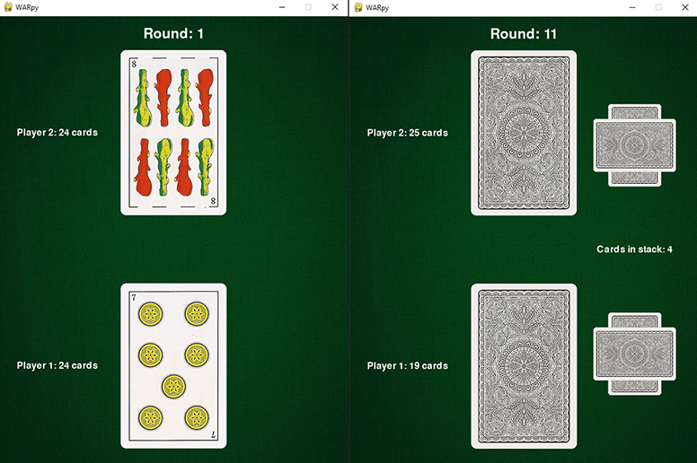

# WARPY

## Description
WARpy is an implementation of the classic card game "War" using Pygame.

I built it as an exercise on the mechanics of a game loop, input collection, and rendering to the screen. During my initial research, I had the opportunity to learn about *finite state machines* and product structure for bigger projects. In the end, I decided to keep everything under just a few files since the project's scope was very small, but I'm sure I'm going to use the newfound knowledge in anything more complex I build in the future. Please check the [references](#references) where I provide links to the learning material I used.

## Requirements
WARpy uses **Python 3.9.1** and **Pygame 2.1.2**.

## How to run the game
The game can be launched by running **warpy.py**, located in the root folder.

## References
I mainly referenced metalburr's excellent forum posts on [python-forum.io](https://python-forum.io) and [mekire's GitHub](https://github.com/Mekire) for ideas on project structure. 

The class code used to load *spritesheets* is taken from the [Pygame wiki](https://www.pygame.org/wiki/Spritesheet) and adjusted according to the project's needs.